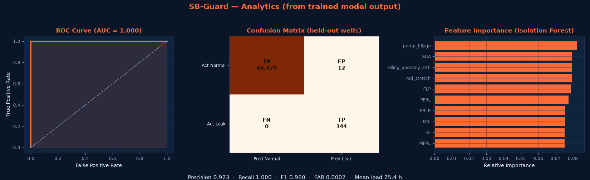
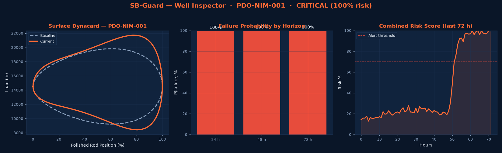
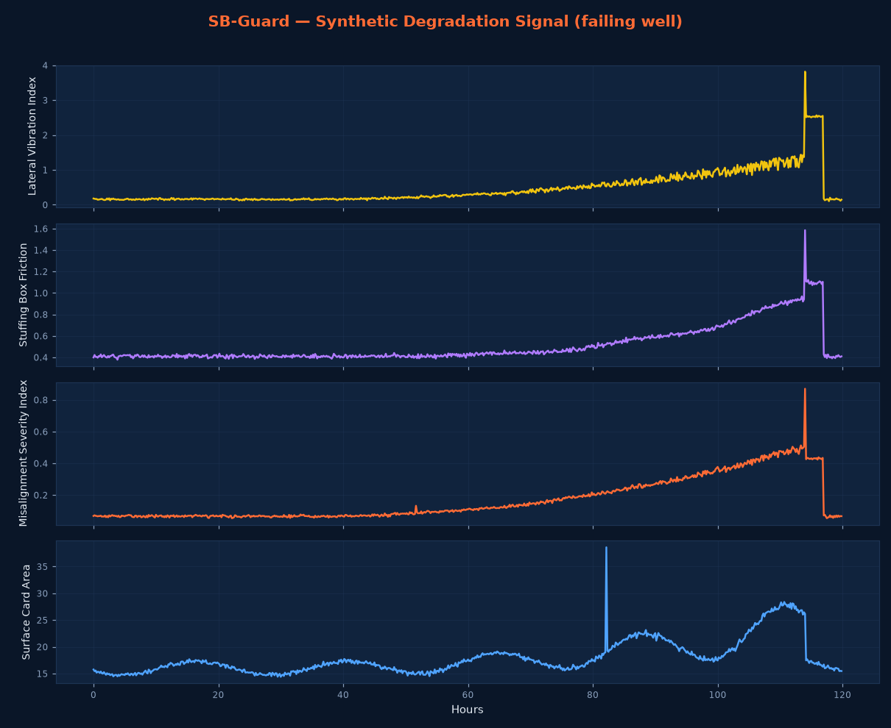

# SB-Guard — Screenshots & Visual Reference

This folder holds reference screenshots of the SB-Guard operator console.

To capture fresh screenshots:

```bash
cd SB-Guard
python run.py            # launches the app at http://127.0.0.1:5000
```

Then capture each page (browser full-page screenshot, 1440px wide recommended):

| File | Page | What to show |
|------|------|--------------|
| `01_dashboard.png`      | Dashboard        | KPI row, fleet health chart, well status grid |
| `02_well_inspector.png` | Well Inspector   | Dynacard overlay, MSI gauge, horizon bars, time-series |
| `03_alerts.png`         | Alerts & History | Active alerts table + history with outcomes |
| `04_analytics.png`      | Analytics        | ROC curve, confusion matrix, feature importance |
| `05_model_mgmt.png`     | Model Management | Retrain progress, threshold slider, version history |

## Rendered previews (from real trained-model output)

These PNGs are generated directly from the trained models and scored fleet —
no browser required — and mirror the live Plotly pages:

| File | Mirrors | Content |
|------|---------|---------|
| `signal_preview.png`    | (raw signal) | 4-stage degradation of a failing well |
| `preview_analytics.png` | Analytics page | ROC curve (AUC 1.0), confusion matrix, feature importance |
| `preview_inspector.png` | Well Inspector | Dynacard overlay, horizon bars, risk timeline vs alert line |

Regenerate them with:

```bash
python docs/make_preview.py             # signal_preview.png
python docs/make_dashboard_preview.py   # preview_analytics.png + preview_inspector.png
```




